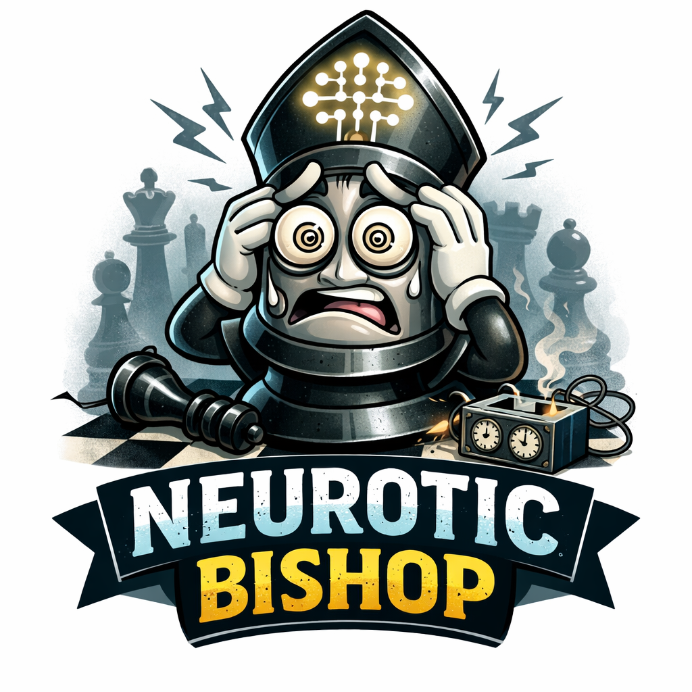

Transformer neural network trained to predict stockfish evals based on lichess games database data. The idea is from the paper, "Grandmaster-Level Chess Without Search" https://arxiv.org/abs/2402.04494, but makes some improvements.

  

